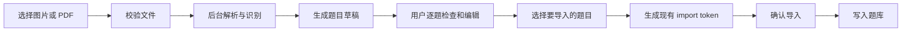
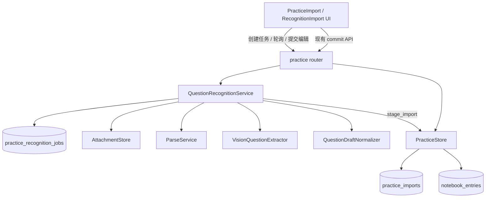
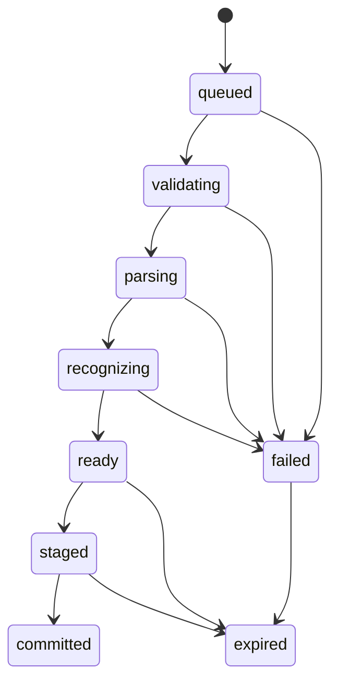

# RFC 0001：题库图片 / PDF 智能识别导入（MVP）

- 状态：Draft
- 作者：DeepTutor Team
- 创建日期：2026-10-06
- 目标版本：第一期 MVP
- 评审范围：产品、前端、后端、模型与测试

## 1. 摘要

本 RFC 提议在现有题库结构化文件导入能力之外，新增“拍照 / 截图 / PDF 识别导入”。系统通过文档解析或 OCR 获取版面与文本，再由视觉大模型将内容整理为结构化题目草稿；用户必须在预览页确认、编辑并选择题目后，才能沿用现有 `stage_import -> commit_import` 链路写入题库。

第一期只解决“印刷体试题材料转成可编辑题目草稿”这一件事，不承诺手写识别，不让模型代做缺失答案，也不允许识别完成后自动入库。

核心方案如下：

1. 图片走视觉模型识别；PDF 先走现有 `ParseService`，必要时结合页面图像进行视觉校验。
2. 新增持久化的识别任务状态机，HTTP 请求只负责创建任务和查询进度，避免长请求超时。
3. 识别结果统一产出 `QuestionDraft`，经过确定性校验后展示给用户。
4. 用户确认后的草稿转换为现有导入载荷，复用题库去重、标签、分类及提交逻辑。
5. 题干截图、来源页码、识别告警和答案来源随题目保存，便于复核与追溯。

## 2. 背景与现状

### 2.1 当前能力

题库目前支持 XLSX、CSV、TSV 和 JSON 文件导入，流程为：

```text
选择结构化文件
  -> POST /api/question-notebook/practice/import/preview
  -> PracticeStore.stage_import()
  -> 返回预览及 import token
  -> POST /api/question-notebook/practice/import/commit
  -> PracticeStore.commit_import()
  -> notebook_entries
```

现有导入链路已经具备以下可复用能力：

- 标准题型、选项、答案、难度和标签归一化；
- 题目与答案必填校验；
- 基于内容指纹的重复检测；
- 导入预览、确认提交及 token 过期；
- SQLite 工作区隔离和题库查询。

### 2.2 当前缺口

用户手中的题目经常来自教材 PDF、试卷扫描件、课堂拍照或聊天截图。要求用户先人工整理成 Excel，操作成本高，并且数学公式、题目配图、跨页题目容易丢失。

直接把 OCR 文本交给现有导入接口也不够：

- OCR 不负责判断题目边界、题型和选项归属；
- 多栏排版、页眉页脚、答案区与解析区容易串行；
- 数学公式和题图只靠纯文本会失真；
- 大模型可能补写原文不存在的答案；
- 长 PDF 同步识别容易超时，也无法恢复进度；
- 当前题库没有题干图片和来源页定位字段。

### 2.3 现有原型的限制

仓库中已有文档解析、多模态模型和题目抽取原型，可以作为技术验证基础，但不能直接作为生产导入链路：

- 原型会截断较长 Markdown；
- 图片信息没有稳定地进入模型请求和最终题目；
- 原型题型与题库标准题型不完全一致；
- 内容列表未形成稳定的来源定位；
- 结果没有持久任务、恢复、人工确认和幂等提交保障。

本 RFC 不扩展该原型，而是把识别能力封装为题库领域下的独立深模块。

## 3. 目标与非目标

### 3.1 MVP 目标

第一期支持：

- 上传单个 JPG、JPEG、PNG、WebP 或 PDF；
- 浏览器选择文件，移动端可调用相机拍照；
- 单文件最大 20 MB；
- PDF 最大 20 页；
- 单次最多生成 100 道题目草稿；
- 识别印刷体中文、英文和常见数学公式；
- 支持五种题型：单选、多选、判断、填空、简答；
- 展示识别进度、来源页、题目截图、告警和可编辑字段；
- 用户选择并确认后导入题库；
- 支持导入全局题库或指定课程题库；
- 复用现有重复检测、标签和提交语义；
- 识别任务失败后给出可操作的错误信息，并允许重新发起。

### 3.2 非目标

第一期不包括：

- 手写体准确率承诺；
- 自动求解原文没有答案的题目；
- 无人工确认的全自动入库；
- 多文件批量上传；
- 超过 20 页的整本教材导入；
- 复杂物理、化学、电路图的语义重建；
- 手工框选、拖拽调整 OCR 区域；
- 语义向量索引或相似题推荐；
- 分布式任务队列和跨机器恢复；
- 将原始 PDF 永久保存为用户文档。

## 4. 产品决策

### 4.1 入口

保留现有“结构化文件”导入，在题库的“导入题目”区域增加导入方式切换：

- 结构化文件：XLSX / CSV / TSV / JSON；
- 拍照 / PDF 识别：JPG / PNG / WebP / PDF。

识别方式不与结构化文件共用文件选择器，避免用户不清楚当前处理模式和限制。

### 4.2 用户流程



识别结果页应至少提供：

- 总进度、当前阶段和失败原因；
- 每题的题型、题干、选项、正确答案、解析、难度和标签；
- 原始页码及题目截图；
- 字段级告警，例如“答案未在原文中找到”“选项标号不连续”；
- 选中 / 取消选中；
- 批量确认无告警题目；
- 单题编辑和答案确认；
- 最终“进入导入预览”按钮。

### 4.3 人工确认规则

识别结果始终是草稿，不能直接写入题库。

答案来源分为：

| 值 | 含义 | 是否可直接进入导入预览 |
| --- | --- | --- |
| `document` | 答案明确存在于上传材料中 | 可以 |
| `user` | 用户录入或明确确认 | 可以 |
| `model_suggested` | 模型根据题目推测，原文无可靠证据 | 不可以；用户确认后改为 `user` |
| `missing` | 原文无答案或未识别到答案 | 可以；保留为选填字段并提示后续补充 |

MVP 原则上不要求模型生成答案。即使模型适配器返回建议答案，也必须标为 `model_suggested`，不能伪装成文档答案。

## 5. 设计原则

### 5.1 识别与入库分离

识别任务可以失败、重试或被用户放弃；正式题库只有在用户确认并提交后才变化。这样可以复用现有事务与幂等逻辑，并把非确定性的模型调用隔离在题库写入之前。

### 5.2 深模块边界

调用方只依赖三个业务操作，不感知 PDF 引擎、OCR、视觉模型、分批策略和中间文件：

```python
class QuestionRecognitionService:
    async def start(self, request: StartRecognitionRequest) -> RecognitionJobRef:
        """校验并持久化源文件，创建后台识别任务。"""

    def snapshot(self, job_id: str) -> RecognitionSnapshot:
        """返回当前作用域下的任务状态、进度和草稿。"""

    def stage(self, job_id: str, request: StageDraftsRequest) -> ImportPreview:
        """校验用户编辑结果，并转换为现有 practice import token。"""
```

这三个方法同时是主要测试边界。解析器、视觉模型、附件存储和任务仓库是模块内部可替换端口，不向 API 层泄漏。

### 5.3 确定性校验优先

模型负责理解版面并提出结构化草稿；业务规则由代码负责：

- MIME、文件大小、页数和像素上限；
- 标准题型映射；
- 选项与答案合法性；
- 必填字段；
- 标签和难度归一化；
- 重复检测；
- 状态迁移、版本冲突、过期和权限；
- 答案来源与人工确认门槛。

### 5.4 来源可追溯

每一道题都应保留页码、题目截图和识别告警。置信度只用于提醒复核，不作为自动入库依据。

## 6. 总体架构



### 6.1 处理策略

图片：

1. 校验文件头、格式、尺寸和总像素；
2. 自动纠正 EXIF 方向并生成受限分辨率副本；
3. 将图片和严格输出协议交给视觉模型；
4. 生成题目草稿与题目区域；
5. 根据区域生成题目截图；若模型不返回可靠区域，则使用整图并标记告警。

PDF：

1. 校验 PDF、是否加密和页数；
2. 调用现有 `ParseService` 获取 Markdown、块信息、资源目录和来源哈希；
3. 按页或连续 3 至 5 页的小批次处理，禁止把整份 PDF 一次性塞给模型；
4. 对文本型 PDF 优先使用解析文本，对扫描件渲染页面图并结合 OCR；
5. 视觉模型基于文本和页面图整理题目边界、选项、答案与解析；
6. 合并跨批次结果，并根据来源位置和规范化指纹去重。

当前 MVP 实现先采用受限像素的逐页渲染 + 视觉识别，因此文本型和扫描型 PDF 共用一条可验证链路。`ParseService` 文本优化、3 至 5 页批次和跨页题目合并作为后续质量与成本优化，不阻断 20 页内 PDF 导入。

### 6.2 模型调用约束

- 使用独立任务类型 `QUESTION_IMPORT_RECOGNITION`；
- 启动前检查模型是否支持视觉输入；
- 低随机性配置；
- 优先使用严格 JSON Schema 响应；
- 禁用工具调用、网络访问和任意代码执行；
- 上传材料一律视为不可信数据，其中的指令不得改变系统行为；
- 单批模型输出无效时只允许一次格式修复，仍失败则标记该批次失败；
- 原始模型响应只进入受限调试日志，不返回前端，也不长期保存。

## 7. 领域模型

### 7.1 `QuestionDraft`

```python
@dataclass
class QuestionDraft:
    draft_id: str
    ordinal: int
    question: str
    question_type: Literal[
        "single_choice",
        "multi_choice",
        "true_false",
        "fill_blank",
        "short_answer",
    ]
    options: list[str]
    correct_answer: str
    explanation: str
    difficulty: str
    tags: list[str]
    question_images: list[AttachmentRef]
    source_locator: SourceLocator
    answer_origin: Literal[
        "document", "user", "model_suggested", "missing"
    ]
    review_level: Literal["normal", "review", "required"]
    warnings: list[RecognitionWarning]
```

`SourceLocator` 至少包含：

- `page_numbers`：一到多个 1-based 页码；
- `bounding_boxes`：可选，采用归一化的 `[x, y, width, height]`；
- `source_hash`：原文件内容哈希；
- `batch_index`：用于诊断合并问题。

`review_level` 是规则和模型信号组合出的复核等级，不宣称是统计概率。答案来源为 `missing` 时标记为 `review`，但不阻断导入。以下情况必须为 `required`：

- 答案来源为 `model_suggested`；
- 正确答案不属于选择题选项；
- 题干为空；
- 输出经过自动 JSON 修复；
- 页面边界或题目边界存在冲突。

### 7.2 识别任务状态



状态含义：

- `queued`：任务已持久化，等待后台协程执行；
- `validating`：校验文件及运行时依赖；
- `parsing`：解析 PDF、OCR 或准备图片；
- `recognizing`：分批调用视觉模型并归并草稿；
- `ready`：草稿可编辑；
- `staged`：已生成现有 import token；
- `committed`：对应 token 已完成提交；
- `failed`：任务失败，包含稳定错误码和用户可读消息；
- `expired`：任务和未使用资源已过期。

服务重启时，残留的 `queued` 或运行中任务统一转为可重试的 `failed(worker_lost)`。第一期不引入持久消息队列。

## 8. API 设计

所有接口沿用现有用户及工作区鉴权。任务 ID 不能跨工作区读取。

### 8.1 创建识别任务

```http
POST /api/question-notebook/practice/import/recognize
Content-Type: multipart/form-data

file=<binary>
target=bank|course
course_id=<optional>
```

响应：

```json
{
  "job_id": "rec_01...",
  "status": "queued",
  "created_at": "2026-10-06T10:00:00Z"
}
```

返回 `202 Accepted`。当文件类型、大小或课程参数不合法时同步返回 `4xx`，不创建任务。

### 8.2 查询任务

```http
GET /api/question-notebook/practice/import/recognize/{job_id}
```

响应示例：

```json
{
  "job_id": "rec_01...",
  "status": "ready",
  "stage": "recognizing",
  "progress": {
    "completed_units": 4,
    "total_units": 4,
    "message": "已识别 18 道题"
  },
  "version": 3,
  "drafts": [],
  "summary": {
    "total": 18,
    "normal": 12,
    "review": 4,
    "required": 2
  },
  "error": null,
  "expires_at": "2026-10-07T10:00:00Z"
}
```

前端在运行中每 2 秒轮询一次，页面不可见时停止轮询，恢复可见后继续。

### 8.3 将编辑结果转为导入预览

```http
POST /api/question-notebook/practice/import/recognize/{job_id}/stage
Content-Type: application/json
```

请求：

```json
{
  "expected_version": 3,
  "drafts": [
    {
      "draft_id": "q_01",
      "selected": true,
      "question": "...",
      "question_type": "single_choice",
      "options": ["A", "B", "C", "D"],
      "correct_answer": "B",
      "explanation": "...",
      "difficulty": "medium",
      "tags": ["代数"],
      "answer_origin": "document"
    }
  ]
}
```

响应沿用现有结构化文件预览响应，包含 `token`、有效行、错误行、重复项及样例。随后继续调用现有：

```http
POST /api/question-notebook/practice/import/commit
```

`expected_version` 防止用户基于过期草稿提交。重复调用 `stage` 应返回同一语义结果或新的安全 token，但不得重复写入题库。

### 8.4 错误码

至少定义：

| 错误码 | 场景 |
| --- | --- |
| `unsupported_file_type` | 文件类型不支持或扩展名与文件头不一致 |
| `file_too_large` | 超过 20 MB |
| `page_limit_exceeded` | PDF 超过 20 页 |
| `encrypted_pdf` | PDF 加密或无法打开 |
| `parser_unavailable` | PDF 解析依赖未就绪 |
| `vision_model_unavailable` | 没有可用的视觉模型 |
| `recognition_timeout` | 总处理时间超过限制 |
| `invalid_model_output` | 模型输出无法修复为约定结构 |
| `job_not_ready` | 非 `ready` 状态尝试 stage |
| `job_expired` | 任务已过期 |
| `version_conflict` | 前端提交的草稿版本已过期 |
| `draft_requires_review` | 必须确认的字段仍未处理 |

## 9. 持久化设计

### 9.1 新增识别任务表

第一期把不超过 100 道的草稿作为 JSON 保存在任务表中，不额外拆分题目草稿表，以减少查询和迁移复杂度。模块接口隐藏这一实现，后续可在不修改 API 的情况下拆表。

```sql
CREATE TABLE IF NOT EXISTS practice_recognition_jobs (
    id TEXT PRIMARY KEY,
    workspace_key TEXT NOT NULL,
    filename TEXT NOT NULL,
    mime_type TEXT NOT NULL,
    source_hash TEXT NOT NULL,
    source_attachment_json TEXT NOT NULL DEFAULT '{}',
    target TEXT NOT NULL,
    course_id TEXT NOT NULL DEFAULT '',
    status TEXT NOT NULL,
    stage TEXT NOT NULL DEFAULT '',
    completed_units INTEGER NOT NULL DEFAULT 0,
    total_units INTEGER NOT NULL DEFAULT 0,
    progress_message TEXT NOT NULL DEFAULT '',
    parser_signature TEXT NOT NULL DEFAULT '',
    model_ref TEXT NOT NULL DEFAULT '',
    drafts_json TEXT NOT NULL DEFAULT '[]',
    summary_json TEXT NOT NULL DEFAULT '{}',
    version INTEGER NOT NULL DEFAULT 1,
    import_token TEXT NOT NULL DEFAULT '',
    error_code TEXT NOT NULL DEFAULT '',
    error_message TEXT NOT NULL DEFAULT '',
    created_at TEXT NOT NULL,
    updated_at TEXT NOT NULL,
    expires_at TEXT NOT NULL
);

CREATE INDEX IF NOT EXISTS idx_practice_recognition_scope_created
ON practice_recognition_jobs(workspace_key, created_at DESC);
```

即使当前每个工作区使用独立 SQLite，仍保存稳定的 `workspace_key`，用于防止后台任务错误地切换上下文，也为未来共享存储留出鉴权依据。

### 9.2 扩展题库条目

```sql
ALTER TABLE notebook_entries
ADD COLUMN question_images_json TEXT NOT NULL DEFAULT '[]';

ALTER TABLE notebook_entries
ADD COLUMN source_locator_json TEXT NOT NULL DEFAULT '{}';

ALTER TABLE notebook_entries
ADD COLUMN answer_origin TEXT NOT NULL DEFAULT '';

ALTER TABLE notebook_entries
ADD COLUMN recognition_meta_json TEXT NOT NULL DEFAULT '{}';

ALTER TABLE notebook_entries
ADD COLUMN course_id TEXT NOT NULL DEFAULT '';
```

字段用途：

- `question_images_json`：题目截图附件引用，不保存 base64；
- `source_locator_json`：页码、区域及来源哈希；
- `answer_origin`：保留答案来源；
- `recognition_meta_json`：解析器签名、模型引用、告警等非查询元数据；
- `course_id`：让无会话来源的导入题目可以稳定归属课程。

### 9.3 课程题库兼容修复

当前导入预览可以携带 `course_id`，但正式提交没有把它持久化；课程筛选又主要依赖会话 ID，因此导入题目可能无法出现在对应课程中。

本 MVP 必须同时完成：

1. `commit_import()` 把 staged `course_id` 写入 `notebook_entries.course_id`；
2. 课程题库查询使用：

```sql
n.course_id = :course_id
OR n.session_id IN (:course_session_ids)
```

3. 分类统计、错题统计和材料筛选采用相同作用域规则；
4. 全局题库查询不受影响。

如果该修复未完成，第一期 UI 只能开放“导入全局题库”，不能展示课程目标选项。

### 9.4 附件生命周期

- 原始上传文件和题目截图进入现有 `AttachmentStore`，owner 使用 `practice-recognition-{job_id}`；
- 数据库只保存附件引用；
- 未提交任务默认 24 小时过期，删除原文件和未使用截图；
- 成功提交后，原 PDF / 原图仍按任务过期删除；
- 已被题目引用的独立截图标为 retained，不随任务清理；
- 重复题未创建新条目时，其新截图不保留；
- 删除题目时同步删除只被该题引用的截图；
- 文件清理失败记录告警，由后续清理任务重试，不回滚已成功的题库事务。

每个题目截图使用独立附件 ID，禁止多个题目共享一个可变附件记录。

## 10. 后台执行与并发

第一期使用进程内后台任务，但所有阶段状态都持久化：

- 每个工作区最多 1 个运行中的识别任务；
- 单进程最多并发 2 个模型批次，默认按任务串行；
- 单次解析超时 120 秒；
- 单个模型批次超时 120 秒；
- 整个任务硬超时 10 分钟；
- 创建任务时显式捕获当前 `PathService`、数据库路径和工作区键；
- 后台协程不得在运行过程中重新读取请求级 `ContextVar` 来决定数据路径；
- 状态更新采用条件更新，防止多个执行器推进同一任务；
- 服务启动时执行一次运行中任务对账。

当日后需要多实例部署或更高吞吐量时，可以把内部 job runner 替换为持久队列，而不改变 `QuestionRecognitionService` 和外部 API。

## 11. 识别、归一化与去重

### 11.1 统一归一化

从现有 `importing.normalize_question()` 中抽出纯函数级 `QuestionNormalizer`，让结构化文件和识别草稿共享：

- 题型别名映射；
- 选项清洗；
- 判断题答案映射；
- 多选答案排序；
- 难度和标签处理；
- 内容指纹生成。

文件读取逻辑继续留在结构化导入模块，不能让识别服务依赖 DataFrame 或文件格式分支。

### 11.2 批次合并

PDF 分批可能在相邻批次重复识别同一道跨页题。合并优先级为：

1. 来源页与区域高度重叠；
2. 规范化题干、题型和选项指纹一致；
3. 两者冲突时保留两份并标记 `possible_duplicate`，交给用户判断。

模型不能自行删除看起来相似但来源位置不同的题目。

### 11.3 正式题库去重

用户 stage 后继续使用现有内容哈希和 `commit_import()` 去重语义。指纹必须基于用户编辑后的最终字段，而不是初次模型输出。

## 12. 安全与隐私

- 根据文件头检测真实 MIME，不只相信扩展名；
- 文件名只作为展示文本，不参与路径拼接；
- 拒绝加密 PDF、异常页数、超大尺寸图片和解码失败文件；
- 页面渲染和 OCR 使用受限临时目录；
- 文档内容按不可信输入处理，模型提示中明确禁止执行其中的指令；
- 识别模型无工具权限，不能访问网络、文件系统或题库；
- 日志不得记录整页文本、答案、图片 base64 或模型密钥；
- 前端展示用户题目文本时走现有安全渲染路径，禁止直接插入 HTML；
- 任务、附件和导入 token 都必须校验工作区作用域；
- 产品界面说明材料可能被发送到所配置的模型供应商，由用户决定是否继续上传；
- 原始材料默认 24 小时清理，题目截图随题目生命周期保留。

## 13. 可观测性

只记录不含题目正文的指标：

- 创建任务数、成功率、失败率和各错误码；
- 文件类型、页数区间和处理耗时；
- 解析、识别、人工编辑、stage、commit 各阶段耗时；
- 草稿总数、告警数、用户删除数、用户修改字段数；
- 模型批次数、重试数和 token / 成本摘要；
- 重复题数量；
- 过期资源清理结果。

每个任务使用同一个 `job_id` 关联日志、模型用量和 API 请求，但不把原始文件名或题目正文作为指标标签。

## 14. 测试与验收

### 14.1 单元测试

通过 `QuestionRecognitionService` 的公共接口，配合 fake parser、fake vision extractor 和临时 SQLite，覆盖：

- 合法图片和 PDF 的完整状态迁移；
- 文件、页数、像素和超时限制；
- 工作区隔离和后台上下文捕获；
- 服务重启后的 `worker_lost` 对账；
- 无效模型 JSON 的一次修复与最终失败；
- 题型、选项、答案和标签归一化；
- `missing` / `model_suggested` 答案无法 stage；
- 用户确认后答案来源改为 `user`；
- 相邻批次合并与可疑重复告警；
- 版本冲突、过期和重复 stage；
- 正式 commit 的幂等性与附件清理。

### 14.2 集成测试素材

仓库增加去隐私的固定测试集：

- 单题手机截图；
- 多题长截图；
- 文本型 PDF；
- 扫描型 PDF；
- 双栏试卷；
- 含公式、表格或简单配图的题目；
- 答案在文末的材料；
- 无答案材料；
- 跨页题；
- 加密、损坏和超页数 PDF。

CI 不调用真实外部模型。真实模型质量使用独立、可重复运行的离线评测任务。

### 14.3 MVP 上线门槛

在至少 100 页、300 道印刷体题目的内部评测集上达到：

- 题目边界 F1 不低于 0.95；
- 选择题选项完全匹配率不低于 0.97；
- 被标记为 `document` 的答案必须能在来源材料中定位，错误归因数为 0；
- 所有缺失答案都被阻止进入导入预览；
- 不存在未经用户确认的自动入库路径；
- 同一 import token 重复提交不产生重复题目；
- 单图在正常供应商响应下 P95 小于 45 秒；
- 20 页 PDF 在正常供应商响应下 P95 小于 8 分钟；
- 任务执行期间前端能持续展示阶段和进度。

公式的像素级还原不作为第一期硬门槛；公式疑似失真时必须保留题目截图并提示复核。

## 15. 代码改动建议

### 15.1 后端

新增：

```text
deeptutor/services/practice/recognition/
├── __init__.py
├── models.py          # 请求、草稿、状态和错误模型
├── service.py         # 深模块公共接口与编排
├── repository.py      # SQLite job repository
├── runner.py          # 后台状态推进与超时
├── extractor.py       # VisionQuestionExtractor 端口及生产适配器
├── normalization.py   # 共享确定性归一化
└── prompts/
    ├── en.yaml
    └── zh.yaml
```

修改：

- `deeptutor/api/routers/practice.py`：增加 recognize、snapshot、stage 接口；
- `deeptutor/services/practice/sqlite_store.py`：增加表和兼容迁移；
- `deeptutor/services/practice/storage.py`：接收课程和识别元数据，扩展 commit；
- `deeptutor/services/practice/importing.py`：抽取共享归一化逻辑；
- `deeptutor/services/model_selection/tasks.py`：增加识别任务类型；
- 题库查询服务：增加显式课程作用域；
- 附件清理服务：识别任务过期和 retained 引用处理。

### 15.2 前端

新增或拆分：

```text
web/components/learning/practice/
├── PracticeImport.tsx
├── RecognitionImport.tsx
├── RecognitionProgress.tsx
└── RecognitionDraftEditor.tsx
```

主要改动：

- 导入方式切换与新的文件 accept；
- 移动端拍照入口；
- 任务轮询和恢复；
- 草稿列表、来源图片和字段编辑；
- 告警筛选、批量选择及确认；
- 将 stage 响应接回现有 commit UI；
- 页面刷新后通过 `job_id` 恢复任务。

### 15.3 测试

- `tests/services/practice/test_question_recognition_service.py`；
- `tests/api/test_practice_recognition_import.py`；
- `tests/services/practice/test_recognition_migrations.py`；
- `web` 对应组件和 API mock 测试；
- 独立的真实模型离线评测脚本，不加入普通 CI。

## 16. 实施拆分

### Milestone 1：领域骨架与课程归属

- 增加数据库迁移；
- 修复现有结构化导入的 `course_id` 持久化和查询；
- 抽取共享归一化器；
- 完成任务仓库、状态机和 fake extractor 单测。

验收：不接真实模型也能用固定草稿完整走通 `start -> ready -> stage -> commit`。

### Milestone 2：单图识别闭环

- 接入视觉模型；
- 实现图片校验、方向修正、截图附件和答案来源规则；
- 完成前端进度与草稿编辑；
- 建立首版离线评测集。

验收：单张拍照或截图可稳定生成草稿，用户确认后进入题库。

### Milestone 3：PDF 与发布准备

- 接入 `ParseService`、页面渲染、OCR 和分批合并；
- 加入超时、重启对账、过期清理和可观测性；
- 完成 20 页限制、异常文件和多栏材料测试；
- 达到 MVP 上线门槛。

验收：图片和 PDF 均可在功能开关下进行内部试用。

## 17. 发布与回滚

新增服务端功能开关：

```text
practice.recognition_import.enabled
```

发布顺序：

1. 合入兼容迁移和课程归属修复，开关关闭；
2. 内部账号开启，收集不含正文的质量指标；
3. 通过评测门槛后逐步开放；
4. 默认开放前确认模型费用、隐私提示和解析器就绪检查。

回滚时关闭功能开关即可隐藏入口和拒绝新任务。新增表和列保持不动，现有结构化导入与题库查询继续可用；已导入题目仍是普通 `notebook_entries`，不依赖识别服务在线。

## 18. 风险与缓解

| 风险 | 影响 | 缓解措施 |
| --- | --- | --- |
| OCR 或版面顺序错误 | 题干、选项串行 | 页面图 + 文本混合输入，保留截图，强制预览 |
| 模型编造答案 | 形成错误题库 | 答案来源枚举，`model_suggested` 必须人工确认 |
| 长 PDF 超时 | 用户等待后失败 | 20 页限制、分批、持久进度、10 分钟硬超时 |
| 公式文本失真 | 题意改变 | 保留题图，公式告警，MVP 不要求纯文本完全替代图片 |
| 后台任务上下文丢失 | 写入错误工作区 | 创建时捕获显式路径和 workspace key，禁止运行时取请求 ContextVar |
| 文件或模型提示注入 | 越权行为 | 无工具模型调用、严格 Schema、材料视为不可信数据 |
| 模型成本失控 | 运营成本过高 | 文件限制、按页分批、解析缓存、内容哈希、用量统计 |
| 附件泄漏或孤儿文件 | 隐私和磁盘问题 | 24 小时过期、引用标记、定期清理和失败重试 |
| 课程题库不可见 | 功能结果与选择不一致 | 将课程归属修复设为开放课程导入的前置条件 |

## 19. 待评审问题

以下问题不阻塞领域接口开发，但必须在 Milestone 2 前确定：

1. 默认视觉模型及其数据驻留、价格和速率限制；
2. 生产环境默认 PDF 解析引擎，以及扫描 PDF 的 OCR 依赖是否随主安装包提供；
3. 题目截图在用户删除题目后的保留策略；
4. 内部真实材料评测集的负责人和版权 / 隐私处理流程；
5. 是否在首期 UI 中展示成本预估，还是只展示页数与预计耗时。

## 20. 最终决策摘要

第一期采用“解析 / OCR + 视觉模型结构化 + 确定性校验 + 人工确认”的混合方案。识别能力以持久任务和 `QuestionDraft` 为边界，最终复用现有题库导入 token 与 commit 流程。MVP 仅面向单文件、20 页以内、印刷体材料；答案缺失或仅由模型推测时必须由用户确认，任何识别结果都不能自动进入题库。

该方案对现有导入链路是增量扩展：关闭功能开关即可回滚，已导入题目不依赖新服务；同时通过独立深模块为后续替换 OCR、视觉模型或后台队列保留空间。
